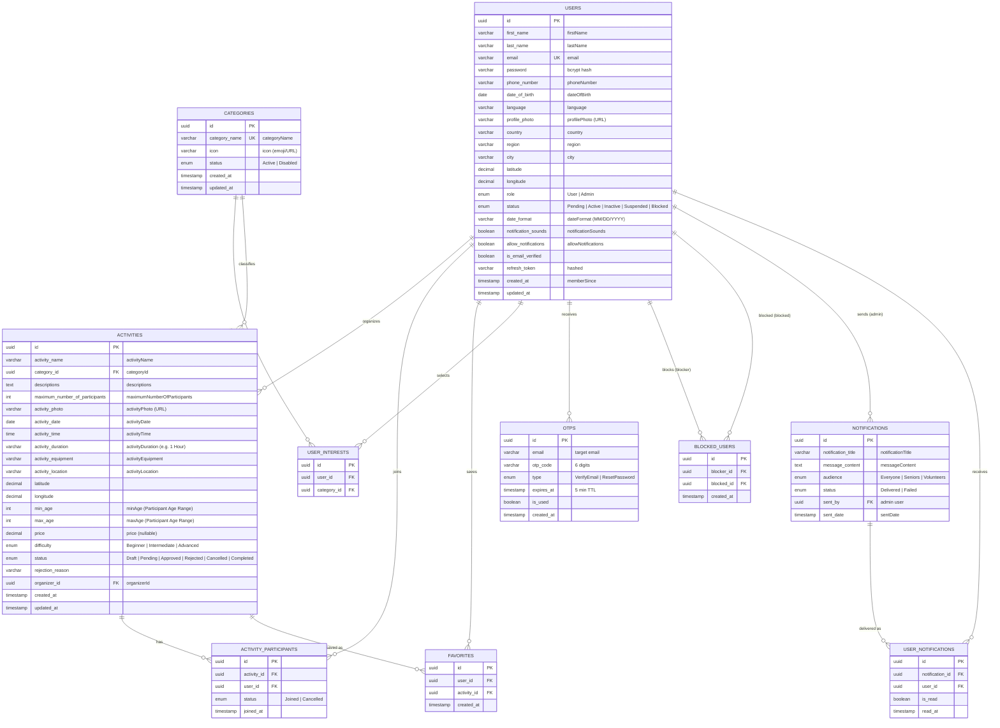

# ER Diagram — Senior Connect Platform

Field names follow the Figma designs (camelCase in API, snake_case columns in PostgreSQL).
Render with any Mermaid viewer (GitHub, VS Code, mermaid.live).

## Constraint notes
- `users.email` unique; login for both mobile users and admins (`role` discriminates).
- `activity_participants (activity_id, user_id)` unique — a user joins an activity once.
- `favorites (user_id, activity_id)` unique.
- `user_interests (user_id, category_id)` unique.
- `blocked_users (blocker_id, blocked_id)` unique.
- Cascade delete: activity → participants/favorites; user → participants, favorites, interests, blocks, user_notifications.
- Counters shown in Figma are **derived**: `activityJoined` = count of `ACTIVITY_PARTICIPANTS` by user; `activityCreated` = count of `ACTIVITIES` by organizer; `activityCount` per category = count of `ACTIVITIES`; `connections` = distinct co-participants.
